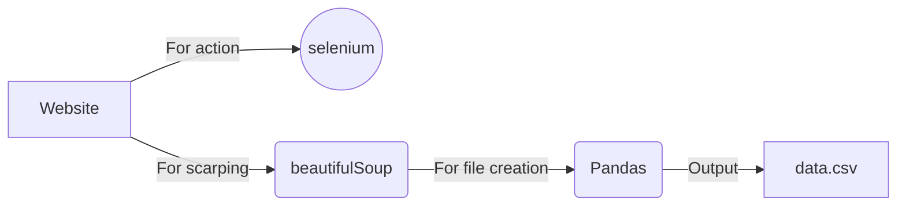

# Web Scarping Using Python - Day 3 (Data Preprocessing)
**chatgpt** --> Explaining this concept to me like I'm 5 years old.

**response** -->  Sure! Imagine you have a magic robot friend who can look at any website and find information for you. This magic robot friend is called Python, and it knows how to scrape (or collect) data from websites.

So, let's say you want to know the latest weather forecast. You tell your robot friend, "Hey Python, can you find me the weather forecast from this website?" Python goes to the website and starts looking at the page. It reads the information on the page, just like you would read a book.

Now, sometimes the information you want is easy to find, like the title of a book on the cover. But other times, it's hidden inside the website, like a secret treasure. That's when Python's special powers come in handy.

Python knows how to look for specific patterns or clues on the website to find the information you want. It might look for certain words, like "temperature" or "sunny." Once Python finds those clues, it grabs the information and brings it back to you.

Then, Python can do cool things with the data it found. It can organize it neatly, put it in a table, or even make a graph. So, when you ask Python for the weather forecast, it goes to the website, finds the information you want, and gives it to you in a way you can understand.

That's basically how web scraping with Python works. It's like having a magic robot friend that can find information on websites and bring it back to you. Pretty cool, right?

# How to view the CSV file in vscode?
Watch this [video](https://github.com/rounaksingh557/Web-Scraping-In-Python/raw/master/Video%20Help/How%20to%20View%20CVS%20%20In%20Vscode.mp4)

Or Download it from [here](https://github.com/rounaksingh557/Web-Scraping-In-Python/blob/master/Video%20Help/How%20to%20View%20CVS%20%20In%20Vscode.mp4)

# Source Code

Source code is present in [Scraper.py](https://github.com/rounaksingh557/Web-Scraping-In-Python/blob/master/Src/scraper.py)

## Flow of Program

